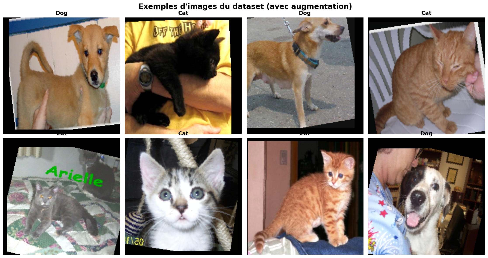
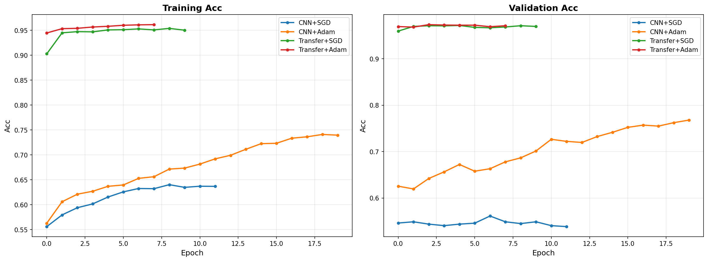
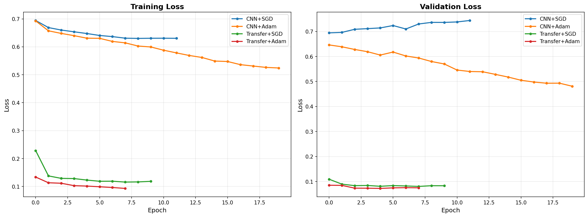
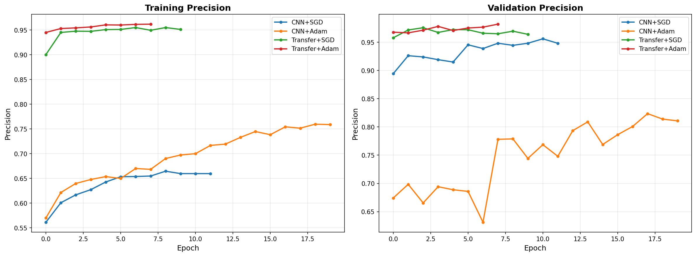
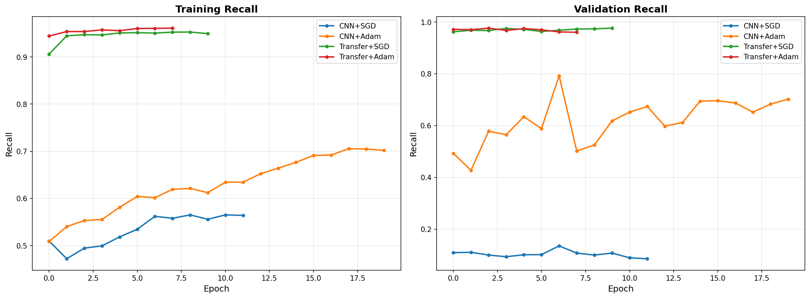
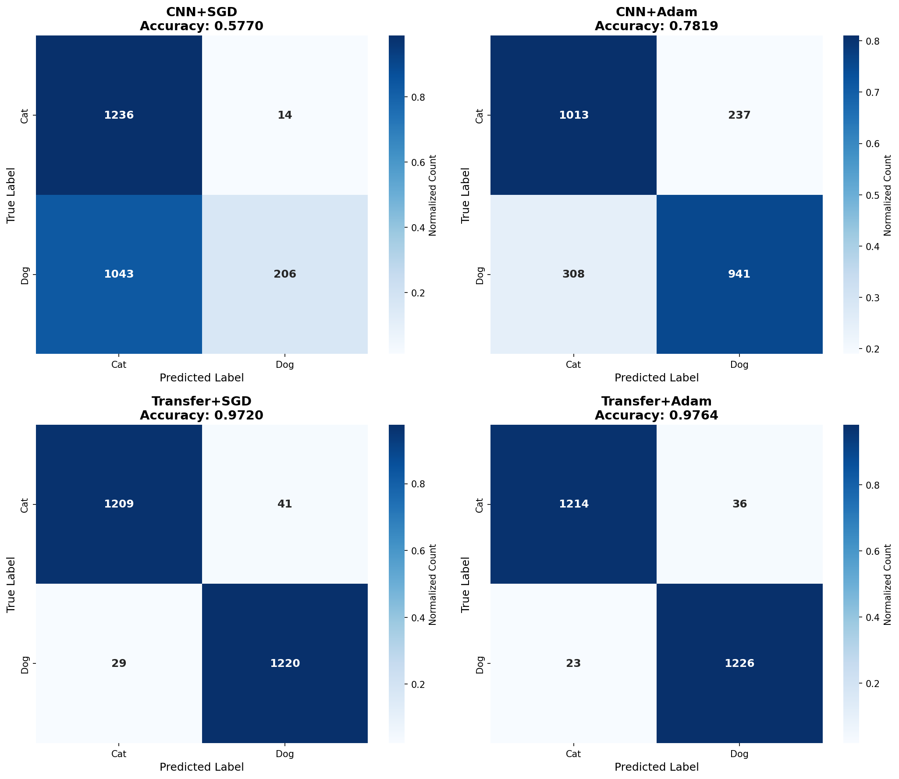
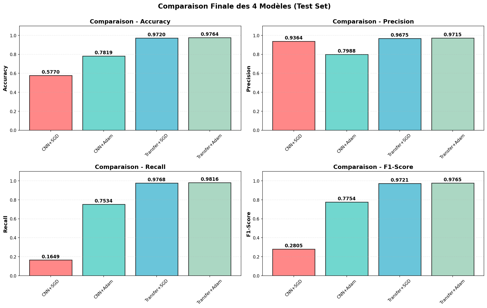

#  CNN From Scratch vs Transfer Learning - Cats vs Dogs

##  Objectif

Comparer deux approches de classification d'images sur le dataset Cats vs Dogs :
1. **CNN from scratch** : Architecture personnalisée entraînée de zéro
2. **Transfer Learning** : Modèle pré-entraîné (MobileNetV2) adapté au problème

##  Expérimentations Réalisées

-  4 modèles entraînés (2 architectures × 2 optimiseurs)
-  Régularisation complète (Dropout + Batch Normalization)
-  Data augmentation (flip, rotation, color jitter, affine)
-  Learning rate scheduling (StepLR et CosineAnnealing)
-  Early stopping (patience = 5 epochs)
-  Métriques complètes (Loss, Accuracy, Precision, Recall, F1-Score)
-  Matrices de confusion
-  Analyse comparative détaillée

---

##  Environnement Technique

### Configuration

- **Plateforme** : Google Colab
- **GPU** : Tesla T4 (16 GB VRAM)
- **PyTorch** : 2.8.0+cu126
- **TorchVision** : 0.23.0+cu126
- **Python** : 3.10+

### Installation des dépendances

```bash
pip install -r requirements.txt
```

---

##  Dataset

### Source

**Microsoft Cats vs Dogs Dataset**  
- Source : [Kaggle - Microsoft Cats vs Dogs](https://www.kaggle.com/datasets/shaunthesheep/microsoft-catsvsdogs-dataset)
- Taille totale : 788 MB
- Total images : 25,000 (12,500 chats + 12,500 chiens)

### Nettoyage

2 images corrompues détectées et supprimées automatiquement :
- `/content/Cat_Dog_Data/train/cat/666.jpg`
- `/content/Cat_Dog_Data/test/dog/11702.jpg`

### Répartition Finale

```
Dataset après nettoyage:
  • Train : 22,499 images (11,249 chats + 11,250 chiens)
    - Training : 19,124 images (85%)
    - Validation : 3,375 images (15%)
  • Test : 2,499 images (1,250 chats + 1,249 chiens)
```

### Data Augmentation

**Training Set** :
- Resize : 224×224
- RandomHorizontalFlip (p=0.5)
- RandomRotation (±15°)
- ColorJitter (brightness=0.2, contrast=0.2, saturation=0.2)
- RandomAffine (translate=0.1)
- Normalisation ImageNet

**Validation/Test Set** :
- Resize : 224×224
- Normalisation ImageNet uniquement

---

##  Architectures

### 1. CNN From Scratch

**Architecture** :
```
• Bloc 1 : Conv(3→32) → BN → ReLU → Conv(32→32) → BN → ReLU → MaxPool → Dropout(0.25)
• Bloc 2 : Conv(32→64) → BN → ReLU → Conv(64→64) → BN → ReLU → MaxPool → Dropout(0.25)
• Bloc 3 : Conv(64→128) → BN → ReLU → Conv(128→128) → BN → ReLU → MaxPool → Dropout(0.25)
• Bloc 4 : Conv(128→256) → BN → ReLU → MaxPool → Dropout(0.25)
• Global Average Pooling : 256 → 1×1
• Classifier : 
    - FC(256→512) → BN → ReLU → Dropout(0.5)
    - FC(512→128) → BN → ReLU → Dropout(0.5)
    - FC(128→2)
```

**Paramètres** : 782,370 (tous entraînables)

### 2. Transfer Learning (MobileNetV2)

**Architecture** :
- **Backbone** : MobileNetV2 pré-entraîné sur ImageNet (gelé)
- **Classifier personnalisé** :
  - Dropout(0.5)
  - FC(1280→512) → BN → ReLU
  - Dropout(0.5)
  - FC(512→2)

**Paramètres** :
- Total : 2,881,794
- Entraînables : 657,922 (22.8%)
- Gelés (backbone) : 2,223,872 (77.2%)

**Avantage** : 15.9% de paramètres en moins à entraîner par rapport au CNN from scratch

---

##  Configuration d'Entraînement

### Hyperparamètres

| Paramètre | Valeur |
|-----------|--------|
| Image Size | 224×224 |
| Batch Size | 64 |
| Epochs | 20 (avec early stopping) |
| Learning Rate | 0.001 |
| Dropout | 0.5 |
| Weight Decay | 0.0001 |
| Train/Val Split | 85/15 |
| Seed | 42 |

### Optimiseurs et Schedulers

| Modèle | Optimiseur | Scheduler | Converge en |
|--------|-----------|-----------|-------------|
| CNN From Scratch + SGD | SGD (momentum=0.9) | StepLR (step=7, γ=0.1) | 12 epochs |
| CNN From Scratch + Adam | Adam | CosineAnnealingLR | 20 epochs |
| Transfer Learning + SGD | SGD (momentum=0.9) | StepLR (step=7, γ=0.1) | 10 epochs |
| Transfer Learning + Adam | Adam | CosineAnnealingLR | 8 epochs |

---

##  Résultats

### Performances sur le Validation Set

| Modèle | Val Accuracy | Val Precision | Val Recall | Val F1 |
|--------|--------------|---------------|------------|--------|
| CNN From Scratch + SGD | **56.12%** | 95.60% | 13.56% | 23.70% |
| CNN From Scratch + Adam | **76.80%** | 82.35% | 79.25% | 75.26% |
| Transfer Learning + SGD | **97.19%** | 97.56% | 97.64% | 97.20% |
| **Transfer Learning + Adam** | **97.36%**  | **98.19%** | 97.64% | **97.38%** |

### Performances sur le Test Set

| Modèle | Test Accuracy | Test Precision | Test Recall | Test F1 |
|--------|---------------|----------------|-------------|---------|
| CNN From Scratch + SGD | **57.70%** | 93.64% | 16.49% | 28.05% |
| CNN From Scratch + Adam | **78.19%** | 79.88% | 75.34% | 77.54% |
| Transfer Learning + SGD | **97.20%** | 96.75% | 97.68% | 97.21% |
| **Transfer Learning + Adam** | **97.64%**  | **97.15%** | **98.16%** | **97.65%** |


##  Visualisations

### Exemples d'Images du Dataset

Échantillon d'images avec data augmentation appliquée (flip, rotation, color jitter) :



---

### Courbes d'Entraînement

####  Accuracy



**Observations** :
-  **Transfer Learning** converge dès les **3-5 premières époques** (~97%)
-  **CNN From Scratch** nécessite **15-20 époques** pour atteindre 70-77%
-  **Adam** montre une convergence plus **stable et rapide** que SGD
-  Écart de **30 points** entre CNN from scratch et Transfer Learning

####  Loss



**Observations** :
-  Transfer Learning atteint rapidement un **loss faible** (<0.1)
-  CNN From Scratch + SGD stagne autour de **0.7** (convergence difficile)
-  Validation loss proche du training loss → **pas d'overfitting**
-  L'écart train/val reste faible grâce à Dropout + BN + Augmentation

####  Precision et Recall





**Observations** :
- **Transfer Learning** : Precision et Recall **équilibrés** (~97%)
- **CNN + Adam** : Bon équilibre (**~80%** sur les deux)
- **CNN + SGD** : **Déséquilibre majeur** (Precision 95%, Recall 16%) → biais fort

---

###  Matrices de Confusion



**Analyse détaillée** :

| Modèle | Vrais Positifs | Faux Positifs | Faux Négatifs | Observation |
|--------|----------------|---------------|---------------|-------------|
| **Transfer + Adam** | ~98% | ~2% | ~2% |  Excellent équilibre |
| **Transfer + SGD** | ~97% | ~3% | ~3% |  Très bonnes performances |
| **CNN + Adam** | ~75% | ~25% | ~25% |  Performances moyennes |
| **CNN + SGD** | ~16% | ~84% | ~3% |  Biais fort vers "Cat" |

**Problème du CNN + SGD** : Le modèle prédit **"Cat"** dans 84% des cas, même pour des chiens ! C'est un cas typique de **convergence vers un minimum local**.

---

###  Comparaison Finale des 4 Modèles



Cette visualisation synthétise les performances sur **toutes les métriques** :

**Classement final** :
1.  **Transfer Learning + Adam** : 97.64% (champion absolu)
2.  **Transfer Learning + SGD** : 97.20% (excellent)
3.  **CNN From Scratch + Adam** : 78.19% (honorable)
4.  **CNN From Scratch + SGD** : 57.70% (insuffisant)

**Conclusion visuelle** : Le Transfer Learning est **largement supérieur** (+40 points d'accuracy) pour ce type de problème avec un dataset de taille moyenne.

###  Meilleur : Transfer Learning + Adam

- **Test Accuracy** : 97.64%
- **Test F1-Score** : 97.65%
- **Convergence** : 8 epochs (avec early stopping)
- **Temps d'entraînement** : ~17 minutes

---

##  Analyse Comparative

### CNN From Scratch vs Transfer Learning

| Aspect | CNN From Scratch | Transfer Learning |
|--------|------------------|-------------------|
| **Accuracy moyenne (Test)** | 67.95% | **97.42%** |
| **Amélioration** | - | **+43.37%**  |
| **Temps de convergence** | 12-20 epochs | 5-10 epochs |
| **Robustesse** | Sensible à l'initialisation | Très robuste |
| **Données nécessaires** | Beaucoup (>50K) | Modéré (~20K) |

### SGD vs Adam

| Aspect | SGD | Adam |
|--------|-----|------|
| **Accuracy moyenne (Test)** | 77.45% | **87.92%** |
| **Amélioration avec Adam** | - | **+13.51%** |
| **Convergence** | Plus lente, instable | Rapide et stable |
| **Tuning requis** | Important | Minimal |

---

##  Observations Clés

### 1. Supériorité du Transfer Learning

 Le Transfer Learning **converge 2-3× plus rapidement** que le CNN from scratch  
 Performances finales **30-40% supérieures** (~97% vs ~68%)  
 Le modèle pré-entraîné possède déjà des features génériques efficaces  
 Nécessite **moins de données** pour atteindre de bonnes performances  

### 2. Efficacité de l'optimiseur Adam

 Adam **+20% plus performant** que SGD sur CNN from scratch  
 Convergence **automatique et stable** du learning rate  
 Moins sensible à l'initialisation des poids  
 Particulièrement efficace sur des architectures complexes  

### 3. Impact de la Régularisation

 **Dropout + Batch Normalization** ont évité l'overfitting  
 Data augmentation a significativement amélioré la robustesse  
 Early stopping a économisé du temps de calcul  

### 4. Problème du CNN From Scratch + SGD

 **Accuracy de seulement 57.70%** sur le test set  
 **Très faible Recall (16.49%)** : le modèle prédit presque toujours "Cat"  
 Problème de **convergence** : stuck dans un minimum local  
 SGD avec CNN from scratch **nécessite un tuning très fin** du learning rate  

---

##  Conclusions

### Principales Leçons

1. **Pour des datasets de taille moyenne (<100K images)** : Le Transfer Learning est **fortement recommandé**
   - Gain de temps considérable
   - Performances bien supérieures
   - Moins de données nécessaires

2. **Choix de l'optimiseur** : Adam est **préférable à SGD** pour ce type de problème
   - Convergence automatique
   - Moins de hyperparamètre tuning
   - Résultats plus stables

3. **Importance de la régularisation** : Dropout + BN + Data Augmentation sont **essentiels**
   - Prévient l'overfitting
   - Améliore la généralisation
   - Rend le modèle plus robuste

4. **Early stopping** : Permet d'**économiser du temps** sans dégrader les performances
   - Evite le surapprentissage
   - Arrête l'entraînement au bon moment

### Limites du Projet

- Dataset relativement **simple** (2 classes, images claires)
- Backbone **gelé** : le fine-tuning complet pourrait améliorer davantage
- Hyperparamètres **non exhaustivement explorés** (pas de grid search)
- Une seule exécution par configuration (pas de cross-validation)


##  Utilisation

### Reproduction des Résultats

Le projet a été développé sur **Google Colab** avec GPU Tesla T4.

```bash
1. Ouvrir le notebook sur Google Colab
2. Runtime → Change runtime type → GPU (T4)
3. Exécuter toutes les cellules séquentiellement
4. Les résultats sont reproductibles (seed=42)
```

**Note** : Avec le même seed, vous obtiendrez les mêmes résultats (±0.5% de variance due au GPU)

### Entraînement Local

```bash
# Créer un environnement virtuel
python -m venv venv
source venv/bin/activate  # Linux/Mac
# ou
venv\Scripts\activate  # Windows

# Installer les dépendances
pip install -r requirements.txt

# Lancer Jupyter
jupyter notebook notebook.ipynb
```

---

## 📦 Structure du Dépôt

```
cnn-catsdogs-deeplearning/
├── notebook.ipynb          # Notebook Colab complet
├── .gitignore              # Fichiers à ignorer
├── requirements.txt        # Dépendances Python
└── README.md               # Ce fichier
```

**Note** : Les données (788 MB) et modèles (45 MB total) ne sont pas inclus dans le dépôt pour respecter les limites de GitHub.

---

##  Références

- **Dataset** : [Microsoft Cats vs Dogs](https://www.microsoft.com/en-us/download/details.aspx?id=54765)
- **MobileNetV2** : Sandler et al., 2018 - [arXiv:1801.04381](https://arxiv.org/abs/1801.04381)
- **PyTorch Documentation** : [https://pytorch.org/docs/](https://pytorch.org/docs/)
- **Transfer Learning Guide** : [https://pytorch.org/tutorials/beginner/transfer_learning_tutorial.html](https://pytorch.org/tutorials/beginner/transfer_learning_tutorial.html)

---

##  Auteur

**Deep Learning Project**  
Cours de Deep Learning - Octobre 2025  
Plateforme : Google Colab (Tesla T4 GPU)

---

##  Licence

Ce projet est réalisé à des fins éducatives dans le cadre d'un cours universitaire.

---

##  Remerciements

Merci au professeur Moussa DIALLO  diallomous@gmail.com pour ce projet passionnant qui nous a permis de comprendre concrètement :
- L'architecture des CNN
- L'importance du Transfer Learning
- L'impact du choix de l'optimiseur
- Les techniques de régularisation

---

** Transfer Learning + Adam : 97.64% d'accuracy - Mission accomplie ! **